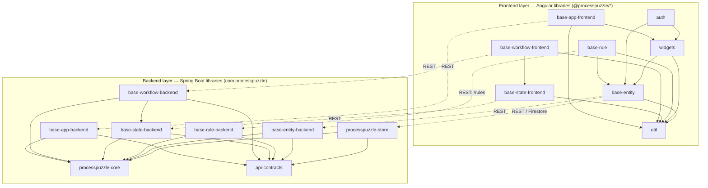
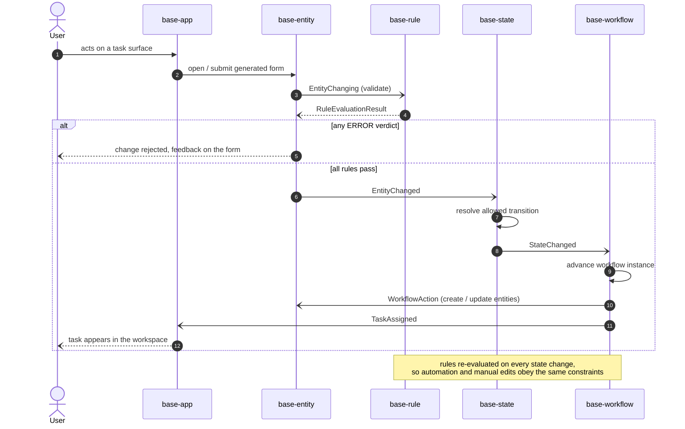
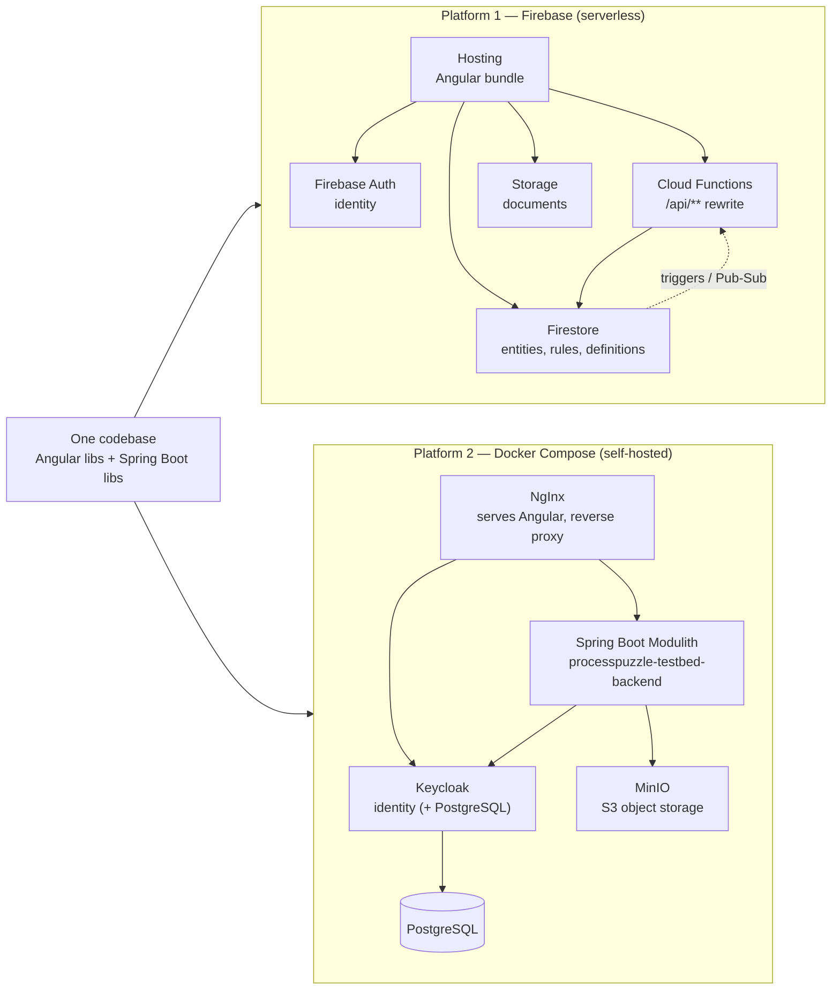

# ProcessPuzzle
## Purpose
ProcessPuzzle is a Low-Code platform for content management and business workflow based applications. For more details see [the ProcessPuzzle website](https://processpuzzle.com). 
ProcessPuzzle has a couple of Building Blocks:
- [ProcessPuzzle Framework](/libs/README.md) – Is a set of libraries for building Low-Code Angular applications
- [ProcessPuzzle Testbed](/apps/processpuzzle-testbed-frontend) – Web application to test and demonstrate the framework capabilities
- **ProcessPuzzle UI** and **ProcessPuzzle Admin** – the Low-Code designer and the staff administration application. Both live in the private `processpuzzle-biz` repository, together with the commercial `platform-admin` feature, and consume the framework libraries above through a submodule – see [Extracting platform-admin](/docs/platform-admin-extraction.md).

Each of these is deployed as a **stack** with its own Keycloak realm, database and object-storage namespace over
shared infrastructure — see [Application stacks](/docs/application-stacks.md) for the naming rules and the target state.
## Architecture
ProcessPuzzle is organized around five **features** — `base-entity`, `base-rule`, `base-state`, `base-workflow`
and `base-app`. Three principles hold them together: every feature is **metadata-driven**, every feature has
a **frontend and a backend** half, and the features talk to each other through **events** rather than direct calls.

### Metadata-driven by design
No feature hard-codes what your application is *about*. Each one interprets a declarative description at run-time:

| Feature | Metadata it interprets | What it produces from that metadata |
| --- | --- | --- |
| `base-entity` | `BaseEntityDescriptor` + `BaseEntityAttributeDescriptor`s | Reactive form, Material table, RSQL search, PDF export |
| `base-rule` | `BaseRule` records (expression + context + severity) | Validation feedback on any generated form |
| `base-state` | State/transition definitions | Allowed transitions and current-state projections |
| `base-workflow` | Workflow definitions | Long-running workflow execution and monitoring |
| `base-app` | Workspace / navigation / panel layout definitions | The shell that hosts everything else |

The pay-off is that **extension is configuration, not code**:
- **Nothing to recompile.** Descriptors and rules are data. A `BaseRule` is a persisted entity, authored through
  a generated CRUD UI and evaluated by `BaseRuleEvaluatorService` at run-time — adding a business rule is a
  database row, not a release.
- **New entity, no new UI.** Declaring a descriptor yields a full CRUD screen. The framework contributes the
  behavior; you contribute the description.
- **Uniform customization surface.** Because the same descriptor drives form, table, search and export, one
  change is reflected everywhere. Theming works the same way — see [Theming](#theming) — CSS custom properties
  cascade at run-time with no rebuild of the framework libraries.
- **Metadata is composable.** `base-rule` reads `base-entity`'s descriptors to know which contexts exist; the
  app shell reads route metadata to build navigation. Features cooperate through each other's metadata rather
  than through each other's internals.
- **Self-describing at run-time** — the same descriptors are what a Low-Code designer such as
  ProcessPuzzle UI edits, so the modelling tool and the runtime never drift apart.

### Two layers per feature
Every feature ships as a pair: an Angular library (`libs/js-shared/*-frontend`, published to npm as
`@processpuzzle/*`) and a Spring Boot library (`libs/java-shared/*-backend`, published as a Maven artifact).
The two halves meet at an OpenAPI contract kept in `api-contracts`, which generates the server-side DTOs.



The frontend dependency edges above are the real `package.json` dependencies; the backend edges are the real
`pom.xml` dependencies. Note that `base-app-backend` names no other feature: what it needs from
outside itself — does this tenant exist, what do its governance rules say — it declares as an
outbound port in `app :: port`, and the deploying application supplies the adapter. `base-state` and
`base-workflow` still carry a compile dependency on the features they adapt, though the calls
themselves already go through their own ports. Note that the two layers mirror each other's shape but are **independently
versioned and independently usable** — a `base-entity` application can run against plain REST, `json-server`
or Firestore without any ProcessPuzzle backend at all.

On the backend those edges are not just Maven's business: each library is a **Spring Modulith application
module** (`app`, `rule`, `basestate`, `workflow`, `store`, plus the open infrastructure modules `core` and
`shared`), declared in a `package-info.java` at the library's root package. A module lists the modules it may
use in `allowedDependencies` and exposes only what it means to — `base-rule`, for instance, publishes
`rule :: usecase` (`EvaluateObject` and the result types) and `rule :: domain` (`Severity` alone), keeping its
repository and rule engine internal. `ProcessPuzzleBackendApplication` in `com.processpuzzle` is the Modulith
root; `ModularityTests` in each library and in the application verify the declarations at build time, so a
reach into another feature's internals fails the build rather than review. `/actuator/modulith` serves the
same structure at run-time.

### Event-driven feature integration
Workflow automation only feels coherent if a data change, a rule verdict, a state transition and a workflow
step are all reactions to the same stream of facts. The features therefore integrate by **publishing and
observing domain events** instead of calling one another:



Why events rather than direct dependencies:
- **Consistency.** A rule guards a change regardless of whether it originated from a user in a form or from a
  workflow step — both paths publish the same `EntityChanging` event.
- **Extensibility.** A new feature subscribes to existing events; no existing feature has to know it exists.
- **Loose coupling.** `base-entity` has no compile-time knowledge of `base-workflow` — visible in the diagram
  above, where no dependency edge joins them.
- **Auditability.** The event stream doubles as the history of *why* an entity reached its current state.

On the backend the events are Spring application events (in-process, transactional). On the frontend they are
signal-based store notifications. On Firebase, Firestore triggers and Pub/Sub carry the same events between
Cloud Functions.

### Feature maturity
The platform is being built feature by feature; the architecture above is the target, and the parts are at
different stages:

| Feature | Frontend | Backend |
| --- | --- | --- |
| `base-entity` | production-ready | scaffold (entities served today by `processpuzzle-store` / REST / Firestore) |
| `base-rule` | production-ready (authoring UI + evaluator) | scaffold |
| `base-state` | authoring UI for state machine definitions; operation layer not started | scaffold |
| `base-workflow` | authoring UI for workflows and tools; read-only monitoring of instances, plus a task dashboard that drives them (claim / complete / skip) | endpoints, use cases and execution engine implemented |
| `base-app` | scaffold | scaffold |

The event contracts and the scaffolded libraries exist so that each feature can be filled in without
reshaping the whole.

### Deployment topologies
The same codebase deploys to **two platforms**, chosen per environment. The application code is identical; only
the adapters bound at startup differ — `BaseEntityFirestoreService` versus `BaseEntityRestService`, OIDC against
Firebase Auth versus Keycloak, Firebase Storage versus MinIO.



**Firebase** — `firebase.json` wires Hosting (the Angular bundle from `dist/apps/*/browser`), an `/api/store/**`
rewrite to the `objectStore` Cloud Function and an `/api/**` one to `jsonServer`, Firestore (rules + indexes),
and Storage rules. The full emulator suite (auth, firestore, functions, storage, pubsub, hosting) runs the same
topology locally. A real project additionally needs three manual GCP settings the deploy cannot make for itself
— default Storage bucket, token-creator grant for signed URIs, public invoker on `objectStore`; see
[Google Cloud Platform (per Firebase project)](/.github/README.md#google-cloud-platform-per-firebase-project).

**Docker Compose** — `tools/docker/docker-compose-ci.yaml` (CI / local) and `docker-compose-prod.yaml`
(production) compose NgInx serving the Angular app and reverse-proxying, the Spring Boot Modulith backend
(where feature modules are Modulith modules and the events above are in-process application events), Keycloak
for identity, PostgreSQL behind both, and MinIO for object storage behind `processpuzzle-store`. The backend
is deployed **once per application stack** — same image, its own database, realm and bucket prefix each; see
[Application stacks](/docs/application-stacks.md).

Running both topologies in CI is deliberate: it keeps platform-specific concerns confined to the adapter layer,
so neither platform can quietly become the only one that works.

## Theming
The framework ships a small set of **named brand colors** as CSS custom properties, defined in
`libs/js-shared/base-widget-frontend/src/theme/pp-colors.css`. Framework components (header, sidenav, cards, form &
card buttons) reference these tokens instead of hard-coded values, so a single stylesheet controls the
platform's look.

### Tokens
| Tier | Token | Default | Used for |
| --- | --- | --- | --- |
| Base | `--pp-color-white` | `#eeeeee` | content background, logo border, on-sidenav text |
| Base | `--pp-color-light-green` | `rgb(92, 218, 207)` | header / footer |
| Base | `--pp-color-light-blue` | `rgb(153, 217, 235)` | content cards |
| Base | `--pp-color-dark-blue` | `rgb(24, 111, 206)` | sidenav |
| Surface | `--pp-surface-header` / `-card` / `-sidenav` / `-base` | → base colors | semantic roles |
| Surface | `--pp-on-sidenav` | `--pp-color-white` | sidenav text |
| Button | `--pp-button-primary-bg` / `-text` | dark-blue / white | Save, card actions |
| Button | `--pp-button-secondary-bg` / `-text` | white / dark-blue | Cancel |
| Button | `--pp-button-delete-bg` / `-text` | light-green / dark-blue | Delete |
| Chip | `--pp-chip-bg` / `-text` | dark-blue / white | TAGS control chips |

### Consuming the theme
Add the token file to your app's `styles` array (Angular `project.json` / `angular.json`), **before** your
own global styles. An application that hosts `base-app` — the designer's Preview tab, or a run-time
`AppShellComponent` — adds the Material theme sheet too:
```jsonc
"styles": [
  "libs/js-shared/base-widget-frontend/src/theme/pp-colors.css",        // or the published package path
  "libs/js-shared/base-app-frontend/src/theme/pp-material-themes.scss", // only if you host base-app
  "src/styles.scss"
]
```

### Per-application Material themes
`AppDefinition.theme.materialTheme` names one of four Material themes and `colorScheme` picks light, dark
or auto. `pp-material-themes.scss` emits each theme under a **class** rather than under `html`, which is
what lets one *subtree* wear a theme: `AppShellComponent` puts `pp-theme-<name> pp-scheme-<scheme>` on its
own host, so a previewed application is themed independently of the designer around it. This is possible
because `mat.theme()` emits nothing but `--mat-sys-*` custom properties, and those cascade — Angular's
prebuilt theme files cannot be used the same way, since their `html` selector is baked in.

Two things to know. If the sheet is not registered the shell still sets the classes and simply inherits
the host application's theme — you lose theming, not correctness. And CDK overlays (dialogs, menus,
tooltips, `mat-select` panels) render into `.cdk-overlay-container` under `<body>`, outside the themed
subtree, so they keep the host's theme; in a standalone deployment this does not arise, because there the
application's theme *is* the document's.

### Overriding colors
Redefine any token in a `:root` block in your **own** global stylesheet (loaded after `pp-colors.css`);
the later declaration wins. Override a **base** color to re-tint every surface derived from it, or a
**surface / button** token to retarget just one place:
```css
/* your app's global styles */
:root {
  --pp-color-light-green: #a8e6cf;   /* recolors header + footer + secondary buttons */
  --pp-surface-sidenav: #0d1b2a;     /* dark sidenav only, base palette untouched */
  --pp-button-primary-bg: #6200ee;   /* Save / Delete / card action buttons only */
}
```
Because the tokens cascade at runtime, no rebuild of the framework libraries is required.

## Technology
### Front-end application development
- **Angular 21** with TypeScript 5.9
- **Angular Material 21** for UI components
- **Angular CDK** for component behaviors
- **NgRx Signals & Component Store** for state management
- **Transloco** for internationalization
- **FontAwesome** for icons
- **Angular Auth OIDC Client** and **Keycloak** for authentication
- **AngularFire** for Firebase integration
- **ngx-markdown** with Prism.js for content rendering
### Front-end unit testing
- **Vitest 4** with jsdom/happy-dom environments
- **Angular Testing Library** for component testing
- **vitest-mock-extended** for mocking
- Coverage reporting via v8 provider
- Nx executor: `@angular/build:unit-test`
### Front-end E2E testing
- **Playwright** with Nx plugin (`@nx/playwright`)
### Build & Bundling
- **esbuild** for fast builds
- **ng-packagr** for library packaging
- **Vite** for development server and build tooling
### Code Quality
- **ESLint 10** with Angular, TypeScript, and Prettier plugins
- **Prettier** for code formatting
### Backend & Development Tools
- **Firebase Functions** for serverless backend
- **json-server** for API mocking
- **oauth2-mock-server** for OAuth testing
### Monorepo
- **Nx 22** monorepo with independent versioning
- Nx Cloud for distributed caching
- Conventional commits for changelog generation
