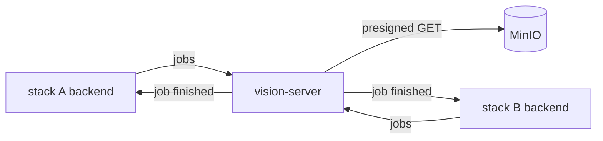

# vision-server

The compute half of ProcessPuzzle's **image recognition**: a Python 3.12 / FastAPI service that runs the models.
Given photos, it finds the subject in each, crops it, computes its appearance embedding and reads its
identifier. Given a video, it follows every subject through it and matches each one against a list of
candidates; given a few frames of one subject, it matches that subject. It runs on CPU; a GPU is a deployment setting, not a code change.

## Where it sits

The vision server is **shared infrastructure**, like Keycloak and MinIO: one instance serves the backend of every
application stack. That is possible because it keeps **no tenant data**. Everything a job needs travels with
the job — presigned URLs of the media, and for recognition the candidates' identifiers and gallery
embeddings — and a result is kept only until the backend has fetched it. Galleries, profiles and decisions all
live in `base-ai-backend`, in each stack's own database.



Jobs run one at a time on a single worker, taking turns between stacks, so one stack's long video cannot starve
another stack's enrollment. Nothing survives a restart, by design: the backend resubmits any job it finds
missing.

## The pipeline

| Step | Model / library | Licence |
|---|---|---|
| Detect the subjects in each photo or sampled video frame | RT-DETR (`PekingU/rtdetr_r18vd_coco_o365`), COCO's 80 classes | Apache-2.0 |
| Follow each subject from frame to frame | ByteTrack, from `supervision` | MIT |
| Pick each track's best frames | size, sharpness, wholly in frame | — |
| Read the identifier, and its mirror image as seen through a translucent sail | EasyOCR | Apache-2.0 |
| Compute the appearance embedding | DINOv2 (`facebook/dinov2-small`) | Apache-2.0 |
| Fuse both scores and assign tracks to candidates one-to-one | SciPy (Hungarian algorithm), RapidFuzz | BSD / MIT |

No component carries a paid or copyleft licence; Ultralytics is not used for that reason.

A track is **auto-matched** when its fused score reaches the profile's `acceptScore` and leads the second-best
candidate by `acceptMargin`; everything else goes to review. A reading only counts when it matches the profile's
identifier pattern after normalisation (upper case, single spaces) — without a pattern, the most confident text
on the boat wins, which is often a sponsor.

## API

`vision-server-api.yaml` in `api-contracts`, under `/v1`, reachable on the infrastructure network only. Every call
except `/health` carries `Authorization: Bearer <VISION_SERVICE_TOKEN>`.

| Call | Purpose |
|---|---|
| `POST /enrollment-jobs` | detect, crop, embed and read the identifier on enrollment photos |
| `POST /embedding-jobs` | re-embed stored crops with the current embedding model |
| `POST /recognition-jobs` | detect, track, read and match the subjects in a video — or the one subject of 1-5 frames |
| `GET /{kind}-jobs/{jobId}/result` | the result of a finished job |
| `GET /jobs/{jobId}`, `DELETE /jobs/{jobId}` | status and progress; cancel, or discard a result |
| `GET /models` | the detector's classes, the embedding model and its dimension, the device |
| `GET /health` | liveness and queue depth, no token |

The caller chooses each `jobId`, so a resubmission is idempotent. When a job finishes the server POSTs
`{jobId, kind, status}` to the job's `callbackUrl` with the job's own `X-Callback-Token`; the notification
carries no result. Crops come back inline as JPEG, embeddings as base64 float32 tagged with their model, errors
as RFC 7807 problem details.

## Running it

In every stack it is a service of `tools/docker/docker-compose-infrastructure.yaml`. Locally and in CI it is
opt-in, behind the `ai` profile:

```shell
COMPOSE_PROFILES=ai npm run stack-up-full
```

On its own:

```shell
docker run --rm -p 8000:8000 -e VISION_SERVICE_TOKEN=dev-token ghcr.io/zszs/processpuzzle-vision-server:latest
```

| Variable | Default | |
|---|---|---|
| `VISION_SERVICE_TOKEN` | — | required; the server refuses to start without it |
| `VISION_DETECTOR_MODEL` | `PekingU/rtdetr_r18vd_coco_o365` | Hugging Face id |
| `VISION_EMBEDDING_MODEL` | `facebook/dinov2-small` | Hugging Face id |
| `VISION_OCR_LANGUAGES` | `en` | EasyOCR language codes |
| `VISION_TORCH_THREADS` | `0` (all cores) | cap CPU use on a shared host; compose sets 2 |
| `VISION_MAX_QUEUED_JOBS` | `20` | beyond it, submissions answer 503 with `Retry-After` |
| `VISION_IDLE_UNLOAD_SECONDS` | `600` | models are dropped after this long idle; `0` keeps them |
| `VISION_RESULT_RETENTION_SECONDS` | `86400` | how long a finished job's result is kept |

The image bakes the model weights in, so a deployment needs no internet access.

### Resources

Measured on CPU with the default models: about **320 MiB idle** — models load on the first job — about
**630 MiB** after an enrollment job, and a peak of about **1.8 GB** with large photos. Enrollment takes roughly
**10–30 seconds per photo**, OCR dominating; the first job after a start or an idle unload adds the model load.
Compose caps the container at 2304m.

## Developing

Everything builds and runs in Docker, so no local Python is needed:

```shell
npm exec nx test vision-server          # unit and contract tests, no model library installed
npm exec nx lint vision-server          # ruff
npm exec nx docker-build vision-server  # the runtime image, models baked in
```

`tests/test_contract.py` keeps `schemas.py` in step with `vision-server-api.yaml`: a field added on one side
only fails there.

### Measuring on real footage

`vision-baseline` runs recognition on a local video without the HTTP service — the quickest way to see how well
the pipeline reads a given fleet's numbers:

```shell
docker run --rm -v "$PWD/clips:/clips" --entrypoint vision-baseline ghcr.io/zszs/processpuzzle-vision-server:latest \
  /clips/start.mp4 --start-list /clips/start-list.csv --pattern '^[A-Z]{3} ?[0-9]{1,5}$' \
  --present "CAN 603" "GER 1234" --out /clips/out
```

`start-list.csv` holds `candidateId,identifier` rows. It writes one crop per track, `tracks.json`, and
`report.json` with the identification rate, the wrong automatic matches and the numbers it missed.
