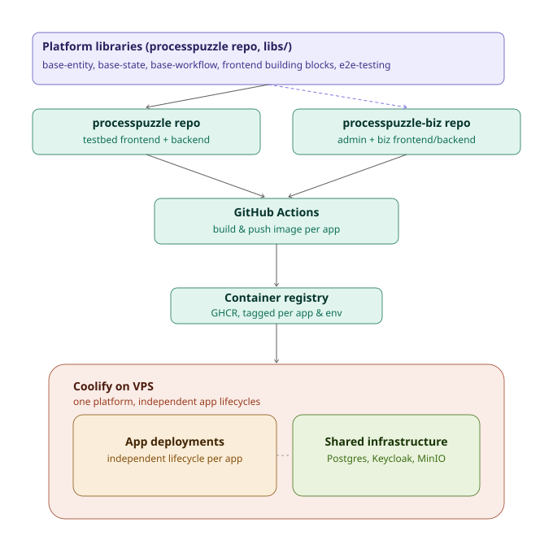

# ProcessPuzzle build & deployment strategy

Status: v1 — infra location decided; tagging strategy proposed as a sensible default, open to revision.

## 1. Source layout

Two GitHub repositories, coupled at build time only (via git submodule), independent at deploy time.

### `processpuzzle` (public)
- `apps/` — **processpuzzle-testbed-frontend**, **processpuzzle-testbed-backend**
- `libs/` — the shared platform feature libraries that both this repo's testbed app *and* the biz repo depend on:
  - `base-entity` (backend + frontend) — two-layer EAV/JSONB entity system
  - `base-state` (backend) — flat state machine engine
  - `base-workflow` (backend) — SPEM-inspired workflow engine
  - `processpuzzle-frontend` building blocks — Angular signals-first components
  - `@processpuzzle/e2e-testing` — metadata-driven E2E testing infrastructure
- Infrastructure definitions for **PostgreSQL**, **Keycloak**, **MinIO** currently live here too (see open question in §6)

### `processpuzzle-biz` (private)
- `apps/` — **processpuzzle-admin-frontend**, **processpuzzle-admin-backend**, **processpuzzle-biz-frontend**, **processpuzzle-biz-backend**
- `libs/` — the libraries that are *commercial* rather than platform, and therefore cannot live in the public repo:
  - `platform-admin-backend` / `platform-admin-frontend` — the org registry, plans, subscriptions, billing and the staff UI over them. **Moved out of the public repo on 2026-09-04**, together with `processpuzzle-admin-frontend`, `processpuzzle-biz-frontend` and `processpuzzle-biz-e2e` — see [Extracting platform-admin](platform-admin-extraction.md)
  - `subscription-backend` / `subscription-frontend` — **do not exist yet**. The thin subscription functionality behind `processpuzzle-biz-frontend`: the public site's signup step and whatever it needs to hand to Admin over the Biz → Admin REST edge
- Pulls in `processpuzzle` as a **git submodule** to reuse the `libs/` platform features above at build time — already configured

> Note that the private repo therefore has libraries of its own, not only applications. Any two of
> its four apps may share one (`platform-admin-*` is Admin-only today, but `subscription-*` is
> consumed by Biz and read by Admin), which is what makes them libraries rather than app-internal
> packages. The public repo's `libs/` list above is abridged — `base-rule`, `base-app`,
> `base-widget`, `base-document`, `org-admin`, `processpuzzle-core`, `processpuzzle-store` and
> `api-contracts` stay public too. In particular **`org-admin` stays**: per-tenant user management is
> a platform feature, not a commercial one.

## 2. What actually gets built

Only the six application images are built and pushed. PostgreSQL, Keycloak, and MinIO are off-the-shelf images (e.g. `postgres:16`, `quay.io/keycloak/keycloak`, `minio/minio`) referenced by tag wherever the shared infrastructure is declared — neither repo builds them.

| Repo | Images built |
|---|---|
| `processpuzzle` | `processpuzzle-testbed-frontend`, `processpuzzle-testbed-backend` |
| `processpuzzle-biz` | `processpuzzle-admin-frontend`, `processpuzzle-admin-backend`, `processpuzzle-biz-frontend`, `processpuzzle-biz-backend` |

## 3. Flow diagram

The platform libraries and the testbed app both live in `processpuzzle`; `processpuzzle-biz` reaches them only through the submodule (dashed arrow) — never a runtime dependency, just a build-time one. Each repo's CI builds and pushes only its own app images; everything lands on the same Coolify instance but as independent, individually redeployable resources sitting on top of one shared infrastructure layer.

## 4. Coolify resource model

Coolify supports two resource types — using the right one per layer is what preserves independent app lifecycles (the property lost with a single docker-compose file):

- **Docker Compose resource** — manages a whole compose file as one unit. Appropriate for the **infrastructure layer** (Postgres, Keycloak, MinIO) since it's conceptually one thing and doesn't need independent redeploys.
- **Application resource** — one Dockerfile/image per resource, each with its own build trigger, environment variables, deploy webhook, and redeploy control. Used for **each of the 6 application images**, so redeploying one app never touches another — the same independence OpenShift's per-app Deployments gave.

All resources sit in the same Coolify project/environment so the application resources have network access to the shared infrastructure resource.

## 5. GitHub Actions setup

Per app, a workflow that:
1. Triggers on push to `main` / a release tag, scoped with `paths:` filters (or driven by `nx affected`) so only the changed app rebuilds
2. Builds the app's Docker image
3. Pushes to GHCR, e.g. `ghcr.io/zszs/processpuzzle-testbed-backend:stage`
4. Calls that app's Coolify deploy webhook (Coolify generates one webhook URL + token per Application resource) to trigger the redeploy

Six small, independent workflows (or one matrix workflow per repo) rather than one monolithic pipeline.

## 6. Repo synchronization

No syncing or merging needed between `processpuzzle` and `processpuzzle-biz`. The existing git submodule is the correct — and only necessary — coupling: it pulls the shared `libs/` platform features into the biz repo's build, and the resulting images are self-contained. Each repo's CI stays fully independent otherwise.

## 7. Shared infrastructure configuration discipline

Each Application resource gets its own environment variables pointing at the *same* shared instances but with per-app identity, per the platform topology:

| App | Database | Keycloak realm | MinIO bucket prefix |
|---|---|---|---|
| Testbed | `PROCESSPUZZLE_TESTBED` | `processpuzzle-testbed` | `processpuzzle-testbed` |
| Biz | `PROCESSPUZZLE_BIZ` | `processpuzzle-biz` | `processpuzzle-biz` (uncertain if needed) |
| Admin | `PROCESSPUZZLE_ADMIN` | `processpuzzle-admin` | `processpuzzle-admin` |

Coolify's project-level shared environment variables (host names, credentials) plus per-resource overrides (db name, realm, bucket) keep "same infra, different identity per app" enforced structurally rather than by convention.

## 8. Decisions log

- **Infra definition location** — resolved: the Postgres/Keycloak/MinIO compose definition lives in the `processpuzzle` repo (as reflected in §1 and §4). The earlier note about a combined testbed+biz docker-compose living in `processpuzzle-biz` is superseded — infra and applications are no longer bundled together at all, per the independent-lifecycle model in §4.

## 9. Proposed default: image tagging & promotion

Not yet decided with certainty — proposed as the sensible default, open to revision:

- Every push to `main` builds and pushes one image tagged with the commit SHA, e.g. `ghcr.io/zszs/processpuzzle-testbed-backend:sha-<commit>`.
- That same image is **promoted**, not rebuilt, from stage to production — re-tag `sha-<commit>` as `:stage` on deploy to stage, and as `:prod` once verified, rather than running a separate build per environment. This guarantees the exact bytes tested on stage are what reach production.
- Coolify's Application resource for stage watches the `:stage` tag; production watches `:prod`.

## 10. Still open

- Dockerfile / workflow YAML template for one app, to replicate across the other five — not yet drafted. Happy to do this next if useful.
