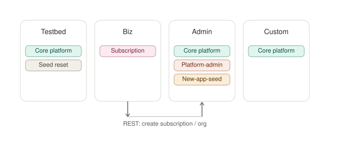
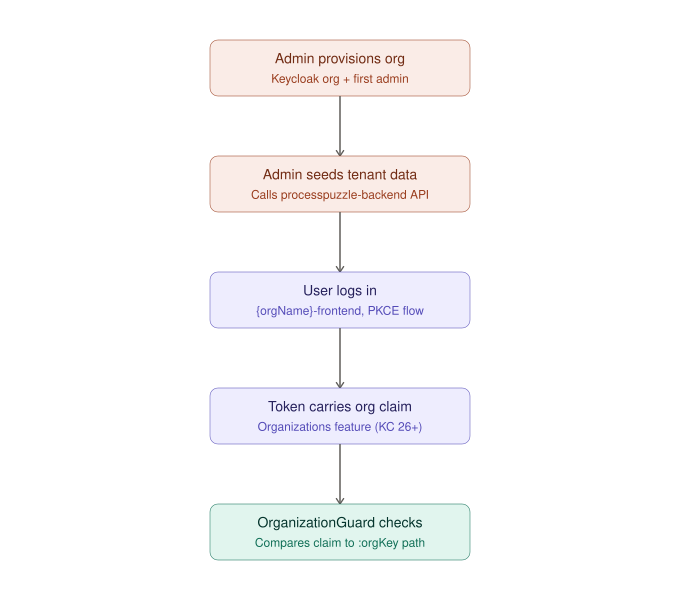
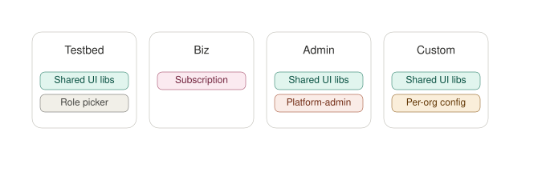
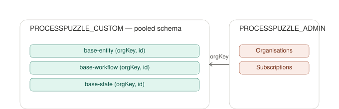

# ProcessPuzzle Platform — Overall Architecture Summary

**Status:** Strategic design session output — decisions confirmed, ready for detailed design/implementation planning.

## 1. Goal

Break the ProcessPuzzle Platform into loosely coupled functional groups, user groups with distinct security requirements, and implementation features, across four deployable application types that share the same underlying infrastructure and platform core.

## 2. The Four Applications

| | Testbed | Biz | Admin | Custom |
|---|---|---|---|---|
| **Purpose** | Developer-facing demo of all platform features | Marketing site + subscription entry point | Platform administration: orgs, admins, subscriptions, billing | Customer's own ProcessPuzzle-based application |
| **Users / security** | Predefined per-role accounts, or self-registration with self-assigned roles | Open browsing; subscription step requires auth | VPN-restricted to PP employees + full auth | Per-org authenticated users |
| **Persistence** | Reinitialized daily (mutable, non-durable) | None (subscription/customer data lives in Admin) | Own schema, migrated as it goes to production | Multi-tenant pooled schema, durable |
| **Features** | All except platform-admin, new-application-seed | Tiny subscription-only backend | All PP features + platform-admin | All except platform-admin |
| **Realm** | `processpuzzle-testbed` | `processpuzzle-biz` | `processpuzzle-admin` | `processpuzzle-custom` (shared, differentiated by Keycloak Organization) |
| **Bucket prefix** | `processpuzzle-testbed` | `processpuzzle-biz` (uncertain if needed) | `processpuzzle-admin` | `processpuzzle-custom` |
| **Database** | `PROCESSPUZZLE_TESTBED` | `PROCESSPUZZLE_BIZ` (design preference; nothing actually persists) | `PROCESSPUZZLE_ADMIN` | `PROCESSPUZZLE_CUSTOM` |
| **Frontend** | `processpuzzle-testbed-frontend` | `processpuzzle-biz-frontend` | `processpuzzle-admin-frontend` | One `custom-shell` build, org resolved at runtime (see §6) |
| **Backend** | `processpuzzle-testbed-backend` | `processpuzzle-biz-backend` | `processpuzzle-admin-backend` | `processpuzzle-backend` (shared across all customers) |

## 3. Shared Infrastructure

One instance of each, serving all four apps:

- **PostgreSQL** — one instance, isolated database per app.
- **Keycloak** — one instance, a distinct realm per app; Custom's realm is shared across all customer orgs, differentiated via Keycloak's native **Organizations** feature.
- **MinIO** — one instance, bucket prefix per app.

## 4. Backend Module Composition

Platform Core (`base-entity`, `base-state`, `base-rule`, `base-workflow`, `base-artifact`, …) is a set of shared Spring Modulith libraries consumed by Testbed, Admin, and Custom — not Biz.

App-specific modules layer on top:

- **platform-admin** — Admin only.
- **new-application-seed** — invoked by Admin to provision a new org's domain data; excluded from Testbed because Testbed never provisions real tenants.
- **subscription** — Biz only, thin.
- **testbed-seed-reset** — Testbed only; a scheduled job reusing the existing seed-YAML generation machinery (built for `@processpuzzle/e2e-testing`) to reinitialize demo data daily.

**Cross-service edges** (the only two — everything else is in-process module composition within a single deployable):

- **Biz → Admin** (REST) — record a new subscription/org.
- **Admin → Custom** (REST) — Admin calls an internal API on `processpuzzle-backend` to seed the new org's domain data. This was chosen over Admin writing directly into `PROCESSPUZZLE_CUSTOM` via a secondary datasource, to keep database ownership clean per app even at the cost of one more service edge.

## 5. Keycloak Multi-Tenancy (Custom)

`processpuzzle-custom` realm uses Keycloak's native **Organizations** feature (GA, Keycloak 26+), purpose-built for multi-tenancy inside a single realm:

- One Keycloak Organization per customer org, keyed by the same `orgKey` used in the `/organizations/{orgKey}` API path.
- The access token automatically carries an `organization` claim once a user authenticates as an org member.
- **OrganizationGuard** (to be promoted to `processpuzzle-core`) checks that claim against the `:orgKey` path segment on every request — no custom group/claim-mapper plumbing needed.
- Org provisioning splits into two Admin-owned actions:
  1. Admin creates the Keycloak Organization + first admin user directly via the Keycloak Admin REST API.
  2. Admin calls the `processpuzzle-backend` internal API to seed the org's domain data (entities, roles, workflows) — see §4.

## 6. Frontend Shell Composition

Shared UI libs (`base-entity-frontend` incl. `WIDGET_REGISTRY`, workflow/state UI, `base-artifact` Tiptap, PDF export, Excel import, RSQL query editor, image upload) are consumed by Testbed, Admin, and Custom shells — not Biz.

- **Testbed shell** — shared UI libs + a demo-only role picker.
- **Admin shell** — shared UI libs + a new `platform-admin-frontend` lib for org/subscription/billing screens.
- **Biz shell** — almost no shared surface; marketing pages + a thin subscription form.
- **Custom shell** — shared UI libs, minus platform-admin.

**Custom frontend tenancy model:** runtime, not build-time. One single build/deployment of `custom-shell`; the org is resolved at bootstrap (subdomain or path, via `APP_INITIALIZER` fetching org config) rather than baking a separate static artifact per org. Onboarding a new customer needs no frontend redeploy — just a config/data entry, consistent with how the rest of the platform treats configuration as data.

> Naming note: `{orgName}-frontend` from the original spec is now a *logical* identifier (used in routing/subdomain resolution) rather than a literal per-org deployable — there is one `custom-shell` build serving every org.

## 7. Database Isolation Model

- **`PROCESSPUZZLE_CUSTOM`** — pooled / shared-schema multi-tenancy. One physical database, one set of tables; every tenant-scoped table's primary key includes `orgKey` (the `@IdClass` composite-key pattern already established in `base-entity`/`base-workflow`). Reinforced with **Postgres row-level security** as a database-level defense-in-depth backstop on top of the existing app-layer enforcement (`@IdClass` + `OrganizationGuard`) — so a missed `orgKey` filter in application code can't leak cross-org data. RLS policies filter on `orgKey`, with the app setting a session-local variable per request (likely alongside `OrganizationGuard`, since both read the same token claim).
- **`PROCESSPUZZLE_ADMIN`** — structurally different: it *is* the org registry (Organisations, Administrators, Subscriptions, Billing), not `orgKey`-scoped tenant data. The pooled-schema pattern doesn't apply here.
- **`PROCESSPUZZLE_TESTBED`** — inherits the same `orgKey`-scoped pooled schema as Custom (same shared libs), so Testbed can demonstrate org isolation itself as one of its showcased features, using a couple of demo orgs.

## 8. Open Items / Not Yet Decided

- Whether Biz genuinely needs a MinIO bucket prefix, given it has no real persistence.
- Detailed schema for `platform-admin` (Organisation, Administrator, Subscription, Billing entities) and its migration strategy once in production.
- Concrete implementation of the RLS session-variable mechanism (interceptor placement, connection pooling implications).
- Per-org theming/branding for the Custom frontend (not required yet, but the runtime-resolved config model leaves room for it).
