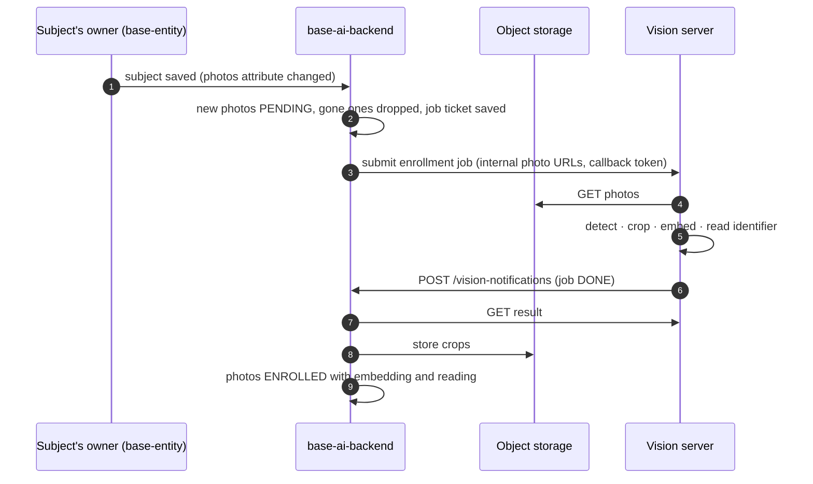
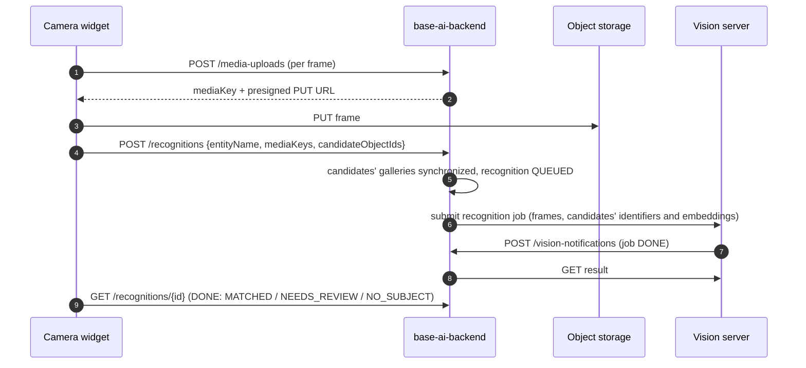

# base-ai-backend


[](https://sonarcloud.io/summary?id=processpuzzle_base_ai_backend)

## Introduction

`base-ai-backend` is the Spring Boot half of ProcessPuzzle's **image recognition** — telling which of a given
list of known objects, such as racing sailboats, is the one in front of the camera, from photos of them taken
beforehand. That is its whole job: what the answer is used for is the calling application's business, and
nothing about it — races, checkpoints, observations — appears here. It is a Spring Modulith application module
(`ai`) that owns everything tenant-specific about recognition: the recognition profiles, every subject's gallery
of crops and embeddings derived from its photos, and the recognitions and jobs that process them.

What it does *not* do is run the models. Detection, OCR and embeddings run in the **vision server**, a separate
Python service shared by every application stack. This module sends it work and stores what comes back, so the
vision server can stay stateless and be scaled, moved to a GPU host or replaced without touching tenant data.

## Architecture





Four properties of these flows are deliberate:

- **The photos are the subject's.** They are an ARTIFACT attribute of the subject's own entity, named by the
  profile's `galleryAttributeKey`, and are edited on its form. This module derives the gallery from them and
  never writes or deletes one.
- **Media bypasses the backend.** Photos and frames go to object storage and from there to the vision server,
  through presigned URLs.
- **Nothing is lost when the vision server is down.** The photos and their job ticket are committed before the
  job is submitted. If submission fails the ticket stays open, and a poller resubmits it — and chases any job
  whose notification never arrived.
- **A notification carries no data.** It only says a job finished; the backend then fetches the result itself.
  Each job has its own random callback token, of which only a hash is stored, so a forged or replayed
  notification can at most trigger a fetch of a real result.

### Module boundaries

The module compiles against no other feature. What it needs from the rest of the platform it declares as
outbound ports in `ai :: port`, which the deploying application implements:

| Port | Question it answers | Testbed adapter |
|---|---|---|
| `MediaStore` | presigned upload / download URLs, storing crops | `processpuzzle-store` (MinIO), bucket `<prefix>-ai-media` |
| `SubjectDirectory` | does the entity type exist, what kind is an attribute, does the object exist, what is its identifier, which photos does it have and their signed URLs | base-entity's `EntityObjectAccess` and processpuzzle-store |
| `VisionServer` | submit jobs, read results | this module's own HTTP adapter, generated from `vision-server-api.yaml` |

`SubjectDirectory` defaults to permitting, so without an adapter any entity type is accepted, no identifier is
known and no subject has photos. `MediaStore` has no sensible default and answers 503 when it is missing.

Inbound, `ai :: galleries` exposes `SubjectGalleries`: the composition root tells it when a subject changed or
was deleted — the testbed relays base-entity's object events — and the gallery follows the photos.

## API

`ai-api.yaml` in `api-contracts`, under `/organizations/{orgKey}`:

| Resource | Operations | State |
|---|---|---|
| `/recognition-profiles`, `/recognition-profiles/{entityName}` | list, create, get, replace, delete | implemented |
| `/media-uploads` | reserve an upload slot for a camera frame (presigned PUT URL) | implemented |
| `/entities/{entityName}/{objectId}/enrollment` | get, synchronize with the subject's photos (202), discard | implemented |
| `/recognitions`, `/recognitions/{recognitionId}` | recognize 1-5 frames against a candidate list (202), poll the outcome | implemented |
| `/vision-notifications` | the vision server's callback, `X-Callback-Token` header | implemented |
| `/ai/translations/{locale}` | the feature's UI bundles | implemented, empty |

Refusals use the platform's `ErrorResponse` with an `errorId` the frontend translates, for example
`ai.profile.entity-not-found`, `ai.media.not-uploaded` or `ai.media.content-type-unsupported`.

### Profile rules

A profile is one per entity type, keyed by the type's **definition code** (`boat`). On save the backend checks
that the type exists, that `galleryAttributeKey` names an attribute that can hold artifacts, that
`identifierAttributeKey` names one of its TEXT attributes, that `identifierPattern`
compiles, and that every threshold is in range. The identifier pattern matters more than it looks: without one,
any confident text on the subject counts as its identifier — a sponsor's name, a neighbouring boat's number.

| Setting | Default | Meaning |
|---|---|---|
| `identifierWeight` | 0.6 | weight of the identifier score in the fused score; appearance gets the rest |
| `acceptScore` | 0.75 | minimum fused score for an automatic match |
| `acceptMargin` | 0.1 | minimum lead over the second-best candidate |
| `sampleFps` | 3 | frames per second of video looked at — reserved for video recognition |

## Using it in an application

**1. Depend on it** — `com.processpuzzle:base-ai-backend` — and let the application's component scan reach
`com.processpuzzle`.

**2. Implement the two ports and relay the subject's changes** in the composition root, never inside a
feature library:

```java
@Bean MediaStore aiMediaStore(FileStorageService storage, @Value("${minio.bucket-prefix:}") String prefix) { … }
@Bean SubjectDirectory aiSubjectDirectory(EntityAttributeQuery attributes, EntityObjectAccess objects, FileStorageService storage) { … }

@TransactionalEventListener void on(EntityObjectUpdatedEvent event) { galleries.subjectChanged(…); }   // and created, deleted
```

**3. Let the callback through the security chain.** `POST /organizations/*/vision-notifications` carries no user
token — it is authenticated by its `X-Callback-Token` — so the resource server must not challenge it:

```java
requests.requestMatchers(HttpMethod.POST, "/organizations/*/vision-notifications").permitAll();
```

**4. Configure the vision server** (`processpuzzle.ai`):

| Property | Default | |
|---|---|---|
| `vision-server.base-url` | — | e.g. `http://processpuzzle-vision-server:8000/v1`; unset means photos and recognitions stay pending |
| `vision-server.service-token` | — | the vision server's `VISION_SERVICE_TOKEN` |
| `vision-server.callback-base-url` | — | this backend as the vision server reaches it, e.g. `http://testbed-backend:8080` |
| `vision-server.stack` | `processpuzzle` | names this stack in the vision server's logs and fair queuing |
| `media.upload-expiry` | `PT30M` | how long a client has to finish an upload |
| `media.max-frame-bytes` | 20 MB | |
| `recognition.retention` | `P1D` | how long a recognition, its frames and its crop are kept |
| `recognition.max-frames` / `max-candidates` | 5 / 1000 | |
| `poller.interval` / `poller.overdue-after` | `PT1M` / `PT10M` | the fallback that resubmits and chases jobs |

**5. Seed profiles (optional).** With `base-ai.loadDefaultProfiles=true` the module imports every
`classpath*:default-recognition-profiles/<orgKey>-recognition-profiles.yaml` on startup. Each file lists
`recognitionProfiles` in the API's `RecognitionProfileInput` shape. The import is create-only: a profile
already present is never overwritten, so a tuned threshold survives restarts.
Unreadable or null YAML documents and invalid profile entries are logged and skipped; later files and
entries are still processed.

## Data

All tables carry `org_key`; the module holds no shared state across tenants.

| Table | Holds |
|---|---|
| `ai_recognition_profiles` | one profile per (organization, entity type) |
| `ai_media_uploads` | frame upload slots; unused ones are swept, with their objects, after they expire |
| `ai_enrollment_photos` | each gallery entry: which of the subject's photos, status, crop location, embedding and its model, reading |
| `ai_recognitions` (+ frames, candidate ids, ranking) | each recognition and its outcome, purged after the retention |
| `ai_vision_job_tickets` | this side's record of every vision job, and the hash of its callback token |

Embeddings are tagged with the model that produced them, because vectors of two models are not comparable: the
vision server refuses a recognition job whose gallery names another model than its own. The crops are kept for
exactly that case — the vision server's embedding job recomputes a gallery from them, so an upgraded model never
means photographing the fleet again. Triggering that re-embedding from this module is not wired up yet.
