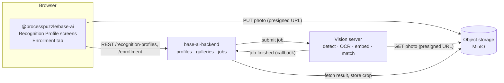

# @processpuzzle/base-ai


[](https://sonarcloud.io/summary?id=processpuzzle_base_ai_frontend)

## Introduction

`@processpuzzle/base-ai` is the Angular half of ProcessPuzzle's **image recognition**: identifying known
objects in photos and videos — a racing sailboat by its sail number, a vehicle by its plate, a runner by a bib
number — without training a model for each new object.

Recognition works by **enrollment and matching**, not by classification. Each object is enrolled once with a
handful of photos. From those photos the platform keeps a crop of the object, an appearance *embedding* (a
numeric fingerprint of what it looks like) and the identifier text it could read on it. When a video is
processed later, every object seen in it is compared against those galleries, by its identifier and by its
appearance, and matched one-to-one against the expected candidates. Adding an object is adding photos — no
model is retrained.

Like every ProcessPuzzle feature it is **metadata-driven**. Which entity type is recognised, which kind of
object the detector looks for, which attribute holds the identifier and how confident a match has to be is a
**Recognition Profile** — a record you author on a generated screen, not code you compile.

## Concepts

| Concept | What it is | In the sailing example |
|---|---|---|
| **Subject** | Any base-entity object that can be recognised | a `Boat` |
| **Recognition profile** | How the subjects of one entity type are recognised: detector class, identifier attribute and pattern, matching thresholds | the `boat` profile |
| **Identifier** | Text painted on the subject that OCR can read; optional | the sail number, `CAN 603` |
| **Enrollment** | The gallery of one subject: its photos, their crops, embeddings and readings | the photos of *Maple Leaf* |
| **Recognition session** | A batch of media identified against a candidate set *(coming next)* | a race start and its start list |

## How it fits together



Photos never pass through the backend: the browser asks for an upload slot, PUTs the file straight to object
storage with the presigned URL it received, and only then hands the slot's key to the enrollment call.
Processing is asynchronous — the vision server works through a queue on CPU, which takes seconds per photo —
and the Enrollment tab re-reads the gallery until every photo has been processed.

## What the library provides

| Export | Purpose |
|---|---|
| `BASE_AI_ROUTES` | The list and form of `Recognition Profile`, mounted at `recognition-profile` |
| `BASE_AI_FACADE_PROVIDERS`, `BASE_AI_ENTITY_FACADES` | The profile's facade, for the root `providers` and for `BASE_ENTITY_FACADE_REGISTRY` |
| `provideEntityEnrollmentTab()` | Adds the **Enrollment** tab to every entity type that has a recognition profile |
| `BASE_AI_TRANSLATION_SOURCE` | Where the `base_ai` translations come from when the assets are not copied |
| `EnrollmentService` | Uploads photos and reads, adds to and clears a subject's gallery |
| `ProfiledEntityRegistry` | Which entity types have a profile — what the tab contributor asks |
| `RecognitionProfile`, `RecognitionProfileService`, `RecognitionProfileStore` | The profile's model, REST service and store, for custom screens |

## Getting started

**1. Register the providers** in the application's root configuration, beside the other base-* features:

```ts
import { BASE_AI_ENTITY_FACADES, BASE_AI_FACADE_PROVIDERS, BASE_AI_TRANSLATION_SOURCE, provideEntityEnrollmentTab } from '@processpuzzle/base-ai';

export const appConfig: ApplicationConfig = {
  providers: [
    ...BASE_AI_FACADE_PROVIDERS,
    ...provideEntityEnrollmentTab(),
    { provide: BASE_ENTITY_FACADE_REGISTRY, useValue: { ...yourEntities, ...BASE_AI_ENTITY_FACADES } },
    { provide: TRANSLATION_SOURCE_REGISTRY, useValue: BASE_AI_TRANSLATION_SOURCE, multi: true },
  ],
};
```

`provideEntityEnrollmentTab()` belongs at the root, not on a route: the tab appears on the *subject's*
screens, wherever those are mounted, and it registers the `base_ai` translation scope for them.

**2. Mount the authoring screens** wherever profiles should be edited:

```ts
{ path: 'ai', children: BASE_AI_ROUTES }   // → /ai/recognition-profile
```

**3. Copy the translations** (English, German, Spanish, French, Hungarian) into the application's assets:

```jsonc
{ "glob": "**/*", "input": "node_modules/@processpuzzle/base-ai/assets/i18n/base_ai", "output": "assets/i18n/base_ai" }
```

**4. Configure the service root.** The library calls `AI_SERVICE_ROOT` from the run-time configuration's
`BASE_CONFIGURATION`, and falls back to `BACKEND_SERVICE_ROOT` when it is absent — which is right whenever one
backend hosts every feature. Both name the organization-scoped root, `<host>/organizations/<orgKey>`.

**5. Author a profile** for the entity type to recognise — or seed one with the backend — and open any object
of that type: its screens now carry an **Enrollment** tab. Entity screens are resolved once per session, so a
profile created while the application is open shows its tab after a reload.

## The Enrollment tab

The tab is the whole enrollment workflow of one subject:

- **Add photos** — JPEG, PNG or WebP, several at once. Photograph the subject from both sides, bow and stern,
  in different light; ten to twenty photos make a good gallery. One subject per photo: a photo with two boats
  of similar size is refused as *Several found*.
- **Watch them being processed.** Each photo starts as *Processing* and becomes:

  | Status | Meaning |
  |---|---|
  | **Enrolled** | The subject was found, cropped and embedded; the crop is shown |
  | **Nothing found** | No object of the profile's detector class in the photo |
  | **Several found** | More than one candidate of similar size — crop the photo or take another |
  | **Failed** | The photo could not be read or processed; the reason is shown |

- **Check the readings.** Under each photo the tab shows the identifier OCR read on it, and flags a reading that
  differs from the identifier registered on the subject. A flag means a wrong photo, or a registration that is
  out of date — both worth fixing before they cause a wrong match.
- **Remove** a photo that is no use, or the whole gallery, e.g. after the subject's sails were replaced.

The gallery's own status sums it up: *Not enrolled*, *Processing*, *Ready* (at least one photo enrolled) or
*Failed* (photos exist, none usable).

## REST resources used

All under `/organizations/{orgKey}`, served by `base-ai-backend`:

| Call | Used by |
|---|---|
| `GET/POST /recognition-profiles`, `GET/PUT/DELETE /recognition-profiles/{entityName}` | the profile screens |
| `POST /media-uploads` → presigned PUT URL | the Enrollment tab, once per photo |
| `GET/DELETE /entities/{entityName}/{objectId}/enrollment` | the Enrollment tab |
| `POST /entities/{entityName}/{objectId}/enrollment/photos`, `DELETE …/photos/{photoId}` | the Enrollment tab |

`entityName` is the entity's **definition code** (`boat`), not its display name (`Boat`); the library
translates between the two through base-entity's definition registry.

## Status

Implemented: recognition profiles and enrollment. Next: recognition sessions — uploading a video of a race
start, the automatic identification of every boat in it, and the review screen for the matches the system is
not sure about.
