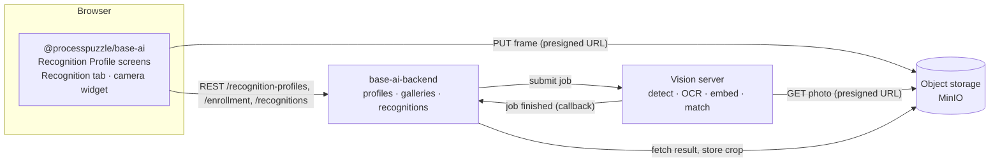

# @processpuzzle/base-ai


[](https://sonarcloud.io/summary?id=processpuzzle_base_ai_frontend)

## Introduction

`@processpuzzle/base-ai` is the Angular half of ProcessPuzzle's **image recognition**: telling which of a
given list of known objects is in front of the camera — a racing sailboat by its sail number, a vehicle by its
plate, a runner by a bib number — without training a model for each new object. What the answer is used for is
the hosting application's business: base-ai knows no races, checkpoints or observations.

Recognition works by **enrollment and matching**, not by classification. Each object carries a handful of
photos of itself, in an ARTIFACT attribute of its own entity. From those photos the platform keeps a crop of the
object, an appearance *embedding* (a numeric fingerprint of what it looks like) and the identifier text it could
read on it. When the camera takes a shot, what it sees is compared against the galleries of the candidates the
application names, by identifier and by appearance. Adding an object is adding photos — no model is retrained.

Like every ProcessPuzzle feature it is **metadata-driven**. Which entity type is recognised, which attribute
holds its photos, which kind of object the detector looks for, which attribute holds the identifier and how
confident a match has to be is a
**Recognition Profile** — a record you author on a generated screen, not code you compile.

## Concepts

| Concept | What it is | In the sailing example |
|---|---|---|
| **Subject** | Any base-entity object that can be recognised | a `Boat` |
| **Recognition profile** | How the subjects of one entity type are recognised: photos attribute, detector class, identifier attribute and pattern, matching thresholds | the `boat` profile |
| **Identifier** | Text painted on the subject that OCR can read; optional | the sail number, `CAN 603` |
| **Enrollment** | The gallery of one subject: what recognition made of its photos — crops, embeddings, readings | the photos of *Maple Leaf* |
| **Recognition** | A camera shot identified against a candidate list the application supplies | a boat at the finish, among the race's entries |

## How it fits together



The reference photos are uploaded like any artifact, on the subject's own form; the backend enrolls them
whenever the subject is saved. Camera frames never pass through the backend: the widget asks for an upload slot,
PUTs the frame straight to object storage with the presigned URL it received, and only then hands the slots'
keys to the recognition call. Processing is asynchronous — the vision server works through a queue on CPU, which
takes seconds — and the tab and the widget re-read until it is done.

## What the library provides

| Export | Purpose |
|---|---|
| `BASE_AI_ROUTES` | The list and form of `Recognition Profile`, mounted at `recognition-profile` |
| `BASE_AI_FACADE_PROVIDERS`, `BASE_AI_ENTITY_FACADES` | The profile's facade, for the root `providers` and for `BASE_ENTITY_FACADE_REGISTRY` |
| `provideEntityEnrollmentTab()` | Adds the **Recognition** tab (the subject's enrollment, at `<entity>/<id>/recognition`) to every entity type that has a recognition profile |
| `BASE_AI_TRANSLATION_SOURCE` | Where the `base_ai` translations come from when the assets are not copied |
| `RecognitionCameraComponent` (`pp-recognition-camera`) | The camera and the hit: inputs `entityName` and `candidates`, output `recognized` |
| `RecognitionService` | Uploads frames, starts a recognition and polls its outcome |
| `EnrollmentService` | Reads, synchronizes and discards a subject's gallery |
| `ProfiledEntityRegistry` | Which entity types have a profile — what the tab contributor asks |
| `RecognitionProfile`, `RecognitionProfileService`, `RecognitionProfileStore` | The profile's model, REST service and store, for custom screens |

## Getting started

**1. Register the providers** in the application's root configuration, beside the other base-* features:

```ts
import { BASE_AI_ENTITY_FACADES, BASE_AI_FACADE_PROVIDERS, BASE_AI_TRANSLATION_SOURCE, provideEntityEnrollmentTab } from '@processpuzzle/base-ai';

export const appConfig: ApplicationConfig = {
  providers: [
    ...BASE_AI_FACADE_PROVIDERS,
    ...provideEntityEnrollmentTab(),
    { provide: BASE_ENTITY_FACADE_REGISTRY, useValue: { ...yourEntities, ...BASE_AI_ENTITY_FACADES } },
    { provide: TRANSLATION_SOURCE_REGISTRY, useValue: BASE_AI_TRANSLATION_SOURCE, multi: true },
  ],
};
```

`provideEntityEnrollmentTab()` belongs at the root, not on a route: the tab appears on the *subject's*
screens, wherever those are mounted, and it registers the `base_ai` translation scope for them.

**2. Mount the authoring screens** wherever profiles should be edited:

```ts
{ path: 'ai', children: BASE_AI_ROUTES }   // → /ai/recognition-profile
```

**3. Copy the translations** (English, German, Spanish, French, Hungarian) into the application's assets:

```jsonc
{ "glob": "**/*", "input": "node_modules/@processpuzzle/base-ai/assets/i18n/base_ai", "output": "assets/i18n/base_ai" }
```

**4. Configure the service root.** The library calls `AI_SERVICE_ROOT` from the run-time configuration's
`BASE_CONFIGURATION`, and falls back to `BACKEND_SERVICE_ROOT` when it is absent — which is right whenever one
backend hosts every feature. Both name the organization-scoped root, `<host>/organizations/<orgKey>`.

**5. Author a profile** for the entity type to recognise — or seed one with the backend — naming an ARTIFACT
attribute (multiplicity `0..n`) of the type as its photos attribute, and open any object of that type: its
screens now carry a **Recognition** tab. Entity screens are resolved once per session, so a
profile created while the application is open shows its tab after a reload.

## The Recognition tab

The tab shows what recognition made of one subject's photos. The photos themselves are added and removed on the
subject's Details form — JPEG, PNG or WebP, from both sides, bow and stern, in different light; ten to twenty
make a good gallery, one subject per photo. Every save of the subject brings the gallery in line.

- **Watch them being processed.** Each photo starts as *Processing* and becomes:

  | Status | Meaning |
  |---|---|
  | **Enrolled** | The subject was found, cropped and embedded; the crop is shown |
  | **Nothing found** | No object of the profile's detector class in the photo |
  | **Several found** | More than one candidate of similar size — crop the photo or take another |
  | **Failed** | The photo could not be read or processed; the reason is shown |

- **Check the readings.** Under each photo the tab shows the identifier OCR read on it, and flags a reading that
  differs from the identifier registered on the subject. A flag means a wrong photo, or a registration that is
  out of date — both worth fixing before they cause a wrong match.
- **Synchronize** asks for the gallery to be brought in line now; **Rebuild** discards it and enrolls every photo
  afresh, e.g. after the profile's detector class changed.

The gallery's own status sums it up: *Not enrolled*, *Processing*, *Ready* (at least one photo enrolled) or
*Failed* (photos exist, none usable).

## The camera widget

```html
<pp-recognition-camera entityName="boat" [candidates]="entries()" (recognized)="record($event)" />
```

`candidates` is the only constraint recognition works with — `{ objectId, label }` for every object that may be
in front of the camera, a race's entry list say. A shot is three frames a quarter of a second apart. A certain
match is reported at once (`automatic: true`); an uncertain one offers the top three to choose from
(`automatic: false`); a certain one can still be overruled, which reports a second hit with the same
`recognitionId`. **Cancel** abandons a shot under way — an answer that still arrives is ignored — or dismisses
the answer shown. Every hit carries `capturedAt`, the time of the shot on the device. Without a camera, the
device's photo picker takes its place.

## REST resources used

All under `/organizations/{orgKey}`, served by `base-ai-backend`:

| Call | Used by |
|---|---|
| `GET/POST /recognition-profiles`, `GET/PUT/DELETE /recognition-profiles/{entityName}` | the profile screens |
| `GET/POST/DELETE /entities/{entityName}/{objectId}/enrollment` | the Recognition tab |
| `POST /media-uploads` → presigned PUT URL | the camera widget, once per frame |
| `POST /recognitions`, `GET /recognitions/{recognitionId}` | the camera widget |

`entityName` is the entity's **definition code** (`boat`), not its display name (`Boat`); the library
translates between the two through base-entity's definition registry.

## Status

Implemented: recognition profiles, galleries that follow the subjects' photos, and snapshot recognition with the
camera widget. Next: recognizing every subject in an uploaded video.
