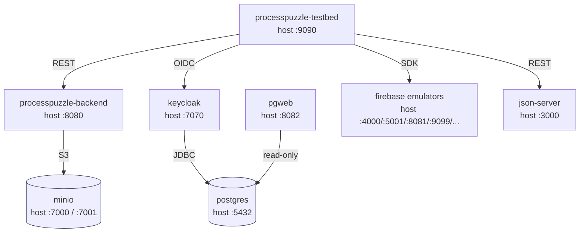

# Tools

Utilities and infrastructure that support local development, CI, and deployment of the ProcessPuzzle platform. Nothing here ships in the production application bundle — these are the scaffolding around it.

## Directory layout

| Path | Purpose |
| --- | --- |
| [`docker/`](./docker) | Dockerfiles and compose stacks for the testbed, backend, and supporting services (Keycloak, MinIO, Postgres, Firebase emulators, json-server). |
| [`firebase/`](./firebase) | Firebase emulator seed data and local Functions sources used by the Firebase container. |
| [`httpRequests/`](./httpRequests) | IntelliJ HTTP Client environment file for ad-hoc requests against local and remote backends. |
| [`mock-backend/`](./mock-backend) | Standalone `json-server` mock with seed `db.json` and a self-signed cert — used when the full backend stack is overkill. |
| [`scripts/`](./scripts) | Build/release helpers: `release.ts`, `run-sonar-scanner.cjs`, `sanitize-lcov.cjs`. |

## Docker stacks

Two compose files at `tools/docker/`:

- **`docker-compose-ci.yaml`** — full local CI stack: testbed, Spring backend, Keycloak (+ Postgres), MinIO, Firebase emulators, json-server, pgweb. Used by the `docker-build` Nx target and by CI to run e2e tests against a production-like topology.
- **`docker-compose-prod.yaml`** — slim image pull definition for the registry images. Used to smoke-test a published image, not to build.

Each service has its own folder under `docker/`, containing the `Dockerfile` plus any init scripts the image needs (e.g. `minio/init-minio.sh`, `postgresql/init-db.sql`, `firebase/serve.sh`).

### Services in the CI stack

| Service | Container | Image | Host port → container | Purpose |
| --- | --- | --- | --- | --- |
| `processpuzzle-testbed` | `processpuzzle-testbed` | `zsuffazs/processpuzzle-testbed` | `9090 → 80` | Angular testbed app served by nginx; entry point for e2e tests. |
| `processpuzzle-backend` | `processpuzzle-backend` | `zsuffazs/processpuzzle-backend` | `8080 → 8080` | Spring Boot backend; talks to MinIO for object storage. |
| `keycloak` | `testbed-keycloak` | `zsuffazs/testbed-keycloak` | `7070 → 8080` | OIDC provider for the testbed. Stores realm data in Postgres. |
| `postgres` | `testbed-postgres` | `zsuffazs/testbed-postgres` | `5432 → 5432` | Postgres for Keycloak; volume `postgres_data`. |
| `pgweb` | `testbed-pgweb` | `zsuffazs/testbed-pgweb` | `8082 → 8081` | Web UI for Postgres inspection, mounted at `/pgweb`. |
| `minio` | `testbed-minio` | `zsuffazs/testbed-minio` | `7000 → 9000` (S3), `7001 → 9001` (console) | S3-compatible object store used by the backend; volume `minio-data`. |
| `firebase` | `testbed-firebase` | `zsuffazs/testbed-firebase` | `4000` UI, `4400` hub, `4600` logging, `5001` functions, `8081` firestore, `8085` pubsub, `9099` auth, `9199` storage | Firebase emulator suite + local Functions; seeded from `tools/firebase/data`. |
| `json-server` | `json-server` | `zsuffazs/json-server` | `3000 → 3000` | REST mock for entities not yet implemented in the backend; seeded from `tools/mock-backend/db.json`. |

> **Port note.** Firestore emulator owns host port `8081`. pgweb is published on host `8082` to avoid the bind collision (it still listens on `8081` inside the container, reached via `http://localhost:8082/pgweb`).

### Service dependency diagram

Arrows show `depends_on` with `condition: service_healthy` — compose blocks each service's startup until every target it points at reports healthy. Edge labels show how the caller reaches the target at runtime.



## How pipeline stages work

The platform recognizes four pipeline stages, each with a different deployment target:

| Stage | Where it runs | How configs reach the browser |
| --- | --- | --- |
| `dev` | Local `nx serve`, no Docker | Angular build assets copy `apps/processpuzzle-testbed/src/run-time-conf/*` straight into `dist/` |
| `ci` | `docker-compose-ci.yaml` on a developer machine or CI runner | Templated at container start (see below) |
| `stage` | Firebase Hosting | Config file dropped into `<hosting-root>/run-time-conf/` by the deploy job |
| `prod` | Firebase Hosting | Same as stage, with prod values |

The Angular `ConfigurationService` (`libs/js-shared/util/src/lib/runtime-configuration/configuration.service.ts`) always fetches `run-time-conf/config.common.json` plus `run-time-conf/config.<PIPELINE_STAGE>.json` from the same origin that served the app. The mechanism for *getting those files into the right place* is what differs per stage.

## Stage-dependent environment variables (the `ci` case)

The browser cannot read container env vars — the JS bundle runs on the user's machine, not inside the nginx container. So the `ci` image renders its runtime config from container env vars **at container startup**, before nginx accepts traffic.

The flow:

1. **Shell / CI runner** exports values:
   ```sh
   export PIPELINE_STAGE=ci
   export FIREBASE_API_KEY=AIza...
   ```
2. **Compose** propagates them into the container via the `environment:` block in `docker-compose-ci.yaml`:
   ```yaml
   environment:
     PIPELINE_STAGE: ${PIPELINE_STAGE:-ci}
     FIREBASE_API_KEY: ${FIREBASE_API_KEY}
   ```
   The `${VAR}` on the right side is compose's substitution, expanded from the shell or a `.env` file next to the compose file.
3. **`docker-entrypoint.sh`** (baked into the image) runs `envsubst` against `config.ci.json.template` and writes the rendered file to `/usr/share/nginx/html/run-time-conf/config.ci.json`, then `exec`s nginx.
4. **Browser** fetches `http://<host>/run-time-conf/config.ci.json` and gets the templated values.

`envsubst`'s whitelist argument (`'${PIPELINE_STAGE} ${FIREBASE_API_KEY}'`) limits which placeholders get expanded — any other `$` in the template survives literally.

**Build-time vs. runtime — don't mix them up:**
- `ARG` in a Dockerfile and `build.args:` in compose → build time only. Use for things that decide what goes *into* the image (which stage's template to copy).
- `ENV` in a Dockerfile and `environment:` in compose → runtime, available to processes inside the container. Use for values the entrypoint script will template into the runtime config.

## Stage-dependent variables (`stage` and `prod`)

Firebase Hosting deploys are static-file uploads; there is no container entrypoint to template anything. The deploy job is responsible for writing the right `config.<stage>.json` next to the bundle before running `firebase deploy`. Secrets typically come from the CI provider's secret store (GitHub Actions secrets, Firebase CI config, etc.) and are injected into a `config.stage.json` / `config.prod.json` file as part of the deploy step.

`config.stage.json` and `config.prod.json` are intentionally **not** committed to the repo — they exist only as deployment artifacts produced by the pipeline.

## Running the CI stack locally

```sh
# from repo root
pnpm nx run processpuzzle-testbed:docker-build   # builds testbed + backend images
cd tools/docker
docker compose -f docker-compose-ci.yaml up
```

A `.env` file in `tools/docker/` is the typical place for `PIPELINE_STAGE` and `FIREBASE_API_KEY`. Keep it gitignored.
