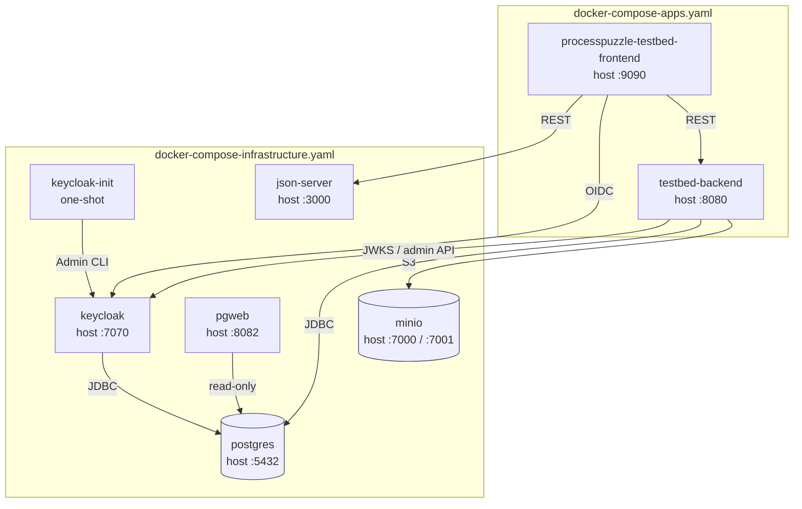

# Tools

Utilities and infrastructure that support local development, CI, and deployment of the ProcessPuzzle platform. Nothing here ships in the production application bundle — these are the scaffolding around it.

## Directory layout

| Path | Purpose |
| --- | --- |
| [`docker/`](./docker) | Dockerfiles and compose stacks for the testbed, backend, and supporting services (Keycloak, MinIO, Postgres, Firebase emulators, json-server). |
| [`firebase/`](./firebase) | Firebase emulator seed data and local Functions sources used by the Firebase container. |
| [`httpRequests/`](./httpRequests) | IntelliJ HTTP Client environment file for ad-hoc requests against local and remote backends. |
| [`mock-backend/`](./mock-backend) | Standalone `json-server` mock with seed `db.json` and a self-signed cert — used when the full backend stack is overkill. |
| [`scripts/`](./scripts) | Build/release helpers: `release.ts`, `run-sonar-scanner.cjs`, `sanitize-lcov.cjs`. |

## Docker stacks

Three compose files at `tools/docker/`, split by **layer** rather than by environment — one shared
infrastructure definition serves `ci`, `stage` and `prod`, and what differs between them is an env
file (see [Environment configuration](#environment-configuration)), not a second compose file. This
mirrors the two Coolify resource types in [`docs/build-deploy-strategy.md`](../docs/build-deploy-strategy.md) §4:

- **`docker-compose-infrastructure.yaml`** — the services every application stack shares: Keycloak (+ its one-shot `keycloak-init`), Postgres, MinIO, json-server, pgweb. Deployed as **one** Docker Compose resource, so redeploying an application never touches it.
- **`docker-compose-apps.yaml`** — the testbed Angular application and its Spring backend, overlaid on the file above. A **holding position**: each app image becomes its own Application resource with its own deploy webhook, at which point this file goes away. `stage` and `prod` do not use it.
- **`docker-compose-pull.yaml`** — overlay that flips the built services to `pull_policy: missing`, for a devcontainer that should not compile an Angular app and a Spring backend before the stack starts.

Overlay the first two to get the full CI topology — which is what every `npm run stack-*` script does:

```sh
docker compose -p processpuzzle --env-file tools/docker/env/.env.ci \
  -f tools/docker/docker-compose-infrastructure.yaml \
  -f tools/docker/docker-compose-apps.yaml up -d --wait
```

Each service has its own folder under `docker/`, containing the `Dockerfile` plus any init scripts the image needs (e.g. `minio/init-minio.sh`, `postgresql/10-init-db.sh`, `firebase/serve.sh`). Five images are **built** rather than pulled, because they bake configuration that has to travel with the image; pgweb is referenced by a pinned upstream tag, since the Dockerfile it used to have added nothing to `sosedoff/pgweb`.

### Services in the CI stack

Host ports are the `ci` values; each is one `PP_*_PUBLISH` variable, which is how `prod` binds the
same services to loopback without a second compose file. The infrastructure images dropped their
`testbed-` prefix and moved to GHCR when this layer became shared by all three application stacks —
the containers were renamed the same way.

| Layer | Service | Container | Image | Host port → container | Purpose |
| --- | --- | --- | --- | --- | --- |
| app | `processpuzzle-testbed-frontend` | `processpuzzle-testbed-frontend` | `zsuffazs/processpuzzle-testbed-frontend` | `9090 → 80` | Angular testbed app served by nginx; entry point for e2e tests. |
| app | `testbed-backend` | `testbed-backend` | `zsuffazs/processpuzzle-testbed-backend` | `8080 → 8080` | Spring Boot backend for the **testbed** stack: database `processpuzzle_testbed`, realm `processpuzzle-testbed`, bucket prefix `processpuzzle-testbed`. |
| infra | `keycloak` | `processpuzzle-keycloak` | `ghcr.io/zszs/processpuzzle-keycloak` | `7070 → 8080` | OIDC provider. One realm per stack, imported from `tools/docker/keycloak/import/`; realm data lives in Postgres. |
| infra | `keycloak-init` | `processpuzzle-keycloak-init` | `ghcr.io/zszs/processpuzzle-keycloak-init` | — | One-shot: creates the `master`-realm service account a backend uses to manage realms and users. Idempotent. |
| infra | `postgres` | `processpuzzle-postgres` | `ghcr.io/zszs/processpuzzle-postgres` | `5432 → 5432` | Postgres for Keycloak **and** for each stack, one database each; volume `postgres_data`. `10-init-db.sh` still creates the admin stack's database, because the databases are shared infrastructure. |
| infra | `pgweb` | `processpuzzle-pgweb` | `sosedoff/pgweb:0.17.0` (upstream, not built) | `8082 → 8081` | Web UI for Postgres inspection, mounted at `/pgweb`. Points at `processpuzzle_testbed`; showing another database means changing `PGWEB_DATABASE`. |
| infra | `minio` | `processpuzzle-minio` | `ghcr.io/zszs/processpuzzle-minio` | `7000 → 9000` (S3), `7001 → 9001` (console) | S3-compatible object store; volume `minio-data`. Buckets are `<stack-prefix>-<purpose>`, and `init-minio.sh` still creates every stack's prefix. |
| infra | `json-server` | `json-server` | `ghcr.io/zszs/processpuzzle-json-server` | `3000 → 3000` | REST mock for the *third-party* sources an application integrates with, never for a ProcessPuzzle feature; seeded from `tools/mock-backend/db.json` (see `tools/mock-backend/README.md`). |

> **Port note.** The Firestore emulator owns host port `8081` and pgweb takes host `8082` to avoid the bind collision (it still listens on `8081` inside the container, reached via `http://localhost:8082/pgweb`). Host ports `9091`/`9092`, `4201`/`4202` and `8083` are now unused here: they belonged to the staff and tenant applications and their backend, which moved to the private `processpuzzle-biz` repository — see [Extracting platform-admin](../docs/platform-admin-extraction.md). The testbed backend keeps `8080` because the Playwright suite and the testbed runtime configuration name it.

> **First start.** `tools/docker/postgresql/10-init-db.sh` creates the two application databases, and Keycloak's `--import-realm` imports a realm only if it does not already exist — both run against a *fresh* `postgres_data` volume only. After changing either, reset with `npm run stack-clean`.

### Service dependency diagram

Arrows show `depends_on` with `condition: service_healthy` — compose blocks each service's startup until every target it points at reports healthy. Edge labels show how the caller reaches the target at runtime.

One backend per application stack; see [`docs/application-stacks.md`](../docs/application-stacks.md). Only the testbed stack's application is built here — the other two stacks' are the private repository's, while their realms, databases and bucket prefixes stay below as shared infrastructure. Every edge that crosses the two boxes points *into* the infrastructure layer, which is what makes the split safe: nothing shared depends on an application.


```mermaid
graph TD
    subgraph APP["docker-compose-apps.yaml"]
      testbed[processpuzzle-testbed-frontend<br/>host :9090]
      tbackend[testbed-backend<br/>host :8080]
    end

    subgraph INFRA["docker-compose-infrastructure.yaml"]
      keycloak[keycloak<br/>host :7070]
      kcinit[keycloak-init<br/>one-shot]
      postgres[(postgres<br/>host :5432)]
      pgweb[pgweb<br/>host :8082]
      minio[(minio<br/>host :7000 / :7001)]
      jsonserver[json-server<br/>host :3000]
    end

    testbed -- REST --> tbackend
    testbed -- OIDC --> keycloak
    testbed -- REST --> jsonserver

    tbackend -- S3 --> minio
    tbackend -- JDBC --> postgres
    tbackend -- "JWKS / admin API" --> keycloak
    kcinit -- "Admin CLI" --> keycloak
    keycloak -- JDBC --> postgres
    pgweb -- read-only --> postgres

    classDef store fill:#eef,stroke:#446
    class postgres,minio store
```

## How pipeline stages work

The platform recognizes four pipeline stages, each with a different deployment target:

| Stage | Where it runs | How configs reach the browser |
| --- | --- | --- |
| `dev` | Local `nx serve`, no Docker | Angular build assets copy `apps/processpuzzle-testbed-frontend/src/run-time-conf/*` straight into `dist/` |
| `ci` | the compose stack on a developer machine or CI runner | Templated at container start (see below) |
| `stage` | Firebase Hosting | Config file dropped into `<hosting-root>/run-time-conf/` by the deploy job |
| `prod` | Firebase Hosting | Same as stage, with prod values |

The Angular `ConfigurationService` (`libs/js-shared/util/src/lib/runtime-configuration/configuration.service.ts`) always fetches `run-time-conf/config.common.json` plus `run-time-conf/config.<PIPELINE_STAGE>.json` from the same origin that served the app. The mechanism for *getting those files into the right place* is what differs per stage.

## Stage-dependent environment variables (the `ci` case)

The browser cannot read container env vars — the JS bundle runs on the user's machine, not inside the nginx container. So the `ci` image renders its runtime config from container env vars **at container startup**, before nginx accepts traffic.

The flow:

1. **Shell / CI runner** exports values:
   ```sh
   export PIPELINE_STAGE=ci
   export FIREBASE_API_KEY=AIza...
   ```
2. **Compose** propagates them into the container via the `environment:` block in `docker-compose-apps.yaml`:
   ```yaml
   environment:
     PIPELINE_STAGE: ${PIPELINE_STAGE:-ci}
     FIREBASE_API_KEY: ${FIREBASE_API_KEY}
   ```
   The `${VAR}` on the right side is compose's substitution, expanded from the shell or a `.env` file next to the compose file.
3. **`docker-entrypoint.sh`** (baked into the image) runs `envsubst` against `config.ci.json.template` and writes the rendered file to `/usr/share/nginx/html/run-time-conf/config.ci.json`, then `exec`s nginx.
4. **Browser** fetches `http://<host>/run-time-conf/config.ci.json` and gets the templated values.

`envsubst`'s whitelist argument (`'${PIPELINE_STAGE} ${FIREBASE_API_KEY}'`) limits which placeholders get expanded — any other `$` in the template survives literally.

**Build-time vs. runtime — don't mix them up:**
- `ARG` in a Dockerfile and `build.args:` in compose → build time only. Use for things that decide what goes *into* the image (which stage's template to copy).
- `ENV` in a Dockerfile and `environment:` in compose → runtime, available to processes inside the container. Use for values the entrypoint script will template into the runtime config.

## Stage-dependent variables (`stage` and `prod`)

Firebase Hosting deploys are static-file uploads; there is no container entrypoint to template anything. The deploy job is responsible for writing the right `config.<stage>.json` next to the bundle before running `firebase deploy`. Secrets typically come from the CI provider's secret store (GitHub Actions secrets, Firebase CI config, etc.) and are injected into a `config.stage.json` / `config.prod.json` file as part of the deploy step.

`config.stage.json` and `config.prod.json` are intentionally **not** committed to the repo — they exist only as deployment artifacts produced by the pipeline.

## Environment configuration

`tools/docker/env/` holds one file per environment, mirroring the
`apps/processpuzzle-testbed-e2e/env/.env.<environment>` convention. They are what make one compose
definition serve three environments:

| File | Committed | Holds |
| --- | --- | --- |
| `.env.ci` | yes | Everything, **including the demo credentials that were always in git**, so `npm run stack-up` needs no setup |
| `.env.stage` / `.env.prod` | yes | Non-secret values only: image tag, the `PP_*_PUBLISH` port mappings, network name, Keycloak hostname, role and database names |
| `.env.example` | yes | Documents each secret variable and where it is consumed |
| `.env.local` | **no** (gitignored) | Copy of `.env.example` with real values, for running the stage/prod topology locally |

Two rules worth knowing:

- **Credentials are not in the committed stage/prod files.** They come from the GitHub Environments `STAGE` and `PROD` (see [`.github/README.md`](../.github/README.md)). `POSTGRES_PASSWORD`, `KEYCLOAK_ADMIN_USERNAME` and `KEYCLOAK_ADMIN_PASSWORD` carry a `${VAR:?…}` guard in the compose file, so a missing one fails at `up` rather than silently at the first request — which is why `docker compose --env-file env/.env.stage … config` is *expected* to fail until they are exported.
- **Coolify does not read these files.** A Coolify Docker Compose resource reads the compose file from git and interpolates it with the resource's *own* environment variables; `--env-file` is not in that path. So `.env.stage` / `.env.prod` are the documented source of truth that has to be entered once into the resource, and `--env-file` is what `ci` and local development use. Because every variable carries a `${VAR:-<ci default>}` default, one missed in Coolify degrades to the CI value rather than to an empty string — check the rendered `docker compose config` on the first deploy.

The infrastructure images live on GHCR. Either the packages are public or `docker login ghcr.io`
first; `npm run stack-up-build` needs neither, since it builds them locally under the same tags.

## Running the CI stack locally

```sh
# from repo root — this workspace is npm, not pnpm; `pnpm nx` quarantines packages and breaks the build
npx nx run processpuzzle-testbed-frontend:docker-build   # builds testbed + backend images
npm run stack-up-build     # infra + apps, building both halves
npm run stack-up-infra     # just the shared services, no applications
npm run stack-ps           # what is up, and how healthy
npm run stack-clean        # down, including volumes — the only way to re-run first-start scripts
```

`.env.ci` supplies `PIPELINE_STAGE` and a placeholder `FIREBASE_API_KEY`, so neither needs exporting;
an exported value still wins, because the shell takes precedence over `--env-file`.
`FIREBASE_API_KEY` is not optional even though nothing in the `ci` stack talks to Firebase: the testbed's
entrypoint (`tools/docker/processpuzzle-testbed-frontend/docker-entrypoint.sh`) fails fast on an unset one, so the container exits
before nginx starts. Any non-empty value will do locally. The other two frontends do not read it.

**Budget four minutes for a cold `up`, and do not read a transient `unhealthy` as a failure.** Measured
locally: Keycloak 40 s on a fresh database but 96 s against a reused one (it spends the difference trying to
reach cluster peers a previous container recorded), and each backend ~145 s, because Spring Modulith computes
the module structure with ArchUnit at startup and both backends now do it at once. The healthchecks carry
`start_period` values that cover this (150 s / 240 s); a probe that fails inside `start_period` does not count
against `retries`. Without them, `depends_on: condition: service_healthy` aborts the whole `up` with
`dependency failed to start` while the services in question are merely still booting.


